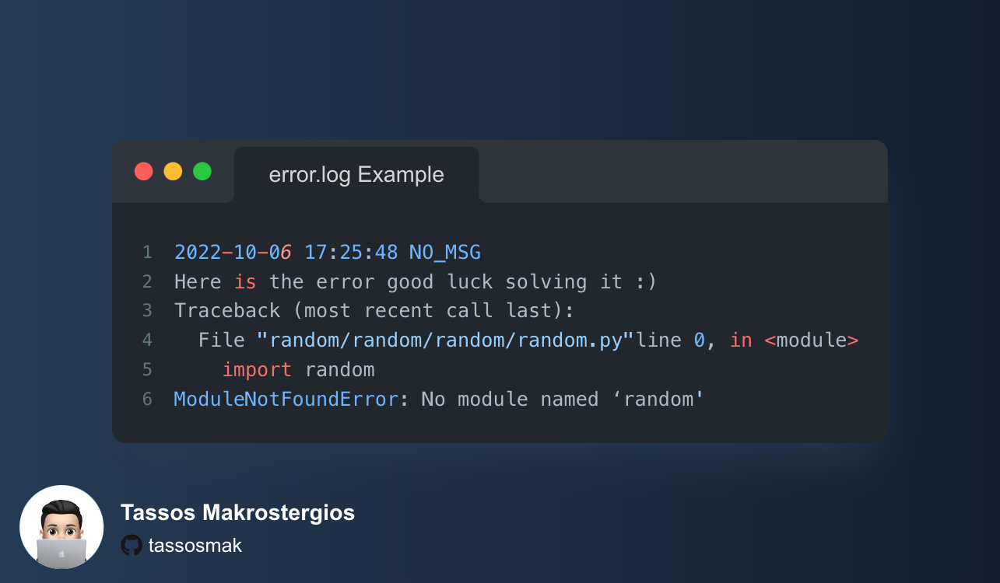

# PyTerminal

PyTerminal is a somewhat terminal interface that still bases on the terminal of your computer(Unix/Windows)

It has 2 Modes:

### The Basic Mode 
it limits the function to the absoloute basic 

### The Advanced Mode 
that offers a bit more features than the basic 

i have also a added a 9 mode but it doesn't serve any purpose it's just for testing purposes :)

## How it Works:
essentially its just an input that then calls a function that procces the input and deliever an 
output based on the mode you are and the parameters that have been set

## Full Details on Commit No.85:
1) every time you launch the program history.log adds the date and hour of the current sension it runs
2) added platform identifier to optimixe the sys commands to improve reliability(for the time it only support the already only supported platforms although it should work to every linux distro to NOT SURE YET)
3) changed from mode 999 to mode 9 to avoid bugs
4) deleted class WorkSpaceHandler to minimize bugs
5) deleted some comments
6) improved the check of multiple instanches at the same time from now it will just not respond to commands that require internet

## Full Details on Commit No.88:
1) added view and edit functions((1)you can only edit files on macOS and possibly to all the other linux distros, (2)when you are editing a .py file it will vim if it installed)
2) added Weather commands that views the 7-Day forecast 
3) added activity monitor(only available to macOS)
4) on the debug we added a menu so you can deal only with the problems you have
5) Bug Fixes

## Full Details On Commit No.105:
 Error_Manager Folder added What it Contains
      logger.py
      errors.log
 logger.py:
  when an error occurs logger.py get's called to record the error and export it to errors.log
  the text that will be added will include the error itself the time of the error and a message if included by the developer 
  
  
  
  Example:
  
 

## Full Details From Commit No.119 to Commit No.123:
 1)now every command that requires waiting will be handled as a external thead so it will be launched into an another Window
  So To give a bit more info
  Now The ClI is seperated to two proceses The Main process Which Will only be the Input Handler
  and the SecondProcess Will be loaded with all the other stuff creating files and all other commands that require user input
2)so all the processes will be moved from the commands.py to the src folder to a standalone file for every process
## Beta 0.4 Comming Soon!

